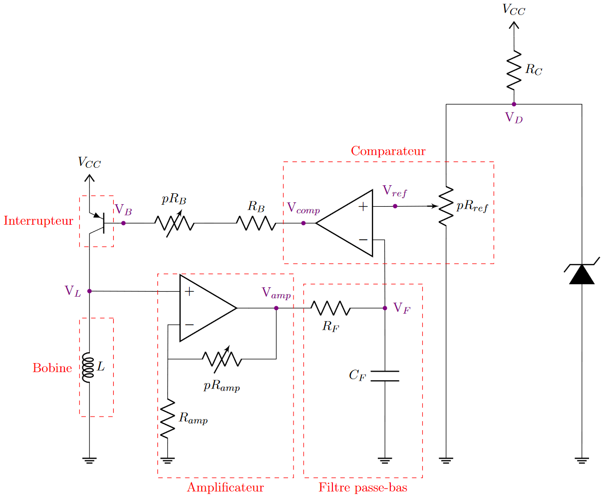

# LEPL1502-Simulation
Program realized as part of the course LEPL1502 given by the EPL (École polytechnique de Louvain).

##Objectives
This program has 3 main objectives:
- Reading and processing of CSV files (generated by an electrical measuring instrument: the picoscope)
- The display of signals in the form of graphs
- The mathematical and physical simulation of the circuit of our project

##Electric circuit

Electrical circuit of WeeMove project.
